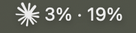
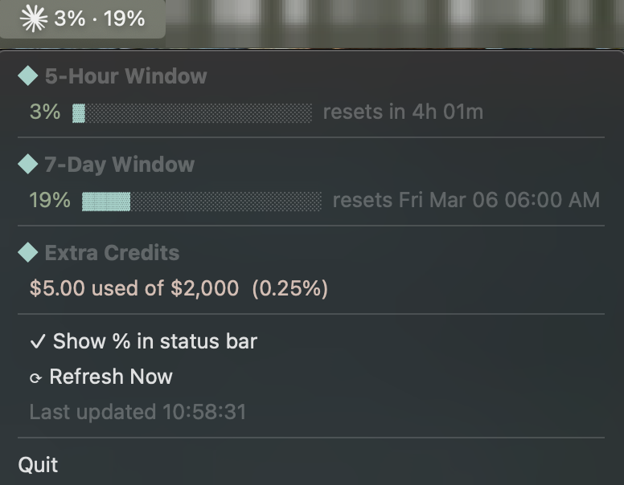

# claude-bar

A macOS menu bar app that shows your real-time [Claude.ai](https://claude.ai) usage — no login required beyond your existing browser session.





## What it shows

- **5-hour window** — your current utilization with a progress bar and time until reset
- **7-day window** — your rolling weekly utilization and next reset date
- **Extra credits** — dollar amount used and remaining (shown only if you have a credit balance)
- **Percentage summary** in the menu bar title (optional, togglable from the menu)

Data refreshes automatically every 5 minutes, or on demand via the menu.

---

## Why this exists

I'm on Claude Pro and use it heavily while working on side projects. Keeping track of the 5-hour and 7-day usage limits meant constantly switching to [claude.ai/settings/usage](https://claude.ai/settings/usage), breaking my flow every time I wanted to know how much headroom I had left.

I tried [CodexBar](https://codexbar.app/) but it was reporting my limits as fully consumed when they weren't, which made it useless for my workflow.

So I built claude-bar: a small menu bar icon that shows the real numbers straight from the Claude API, always visible, always accurate, zero clicks needed.

---

## Privacy and Security

This section is here first because it matters most.

### What claude-bar accesses

claude-bar reads **one session cookie** (`sessionKey` or `__Secure-next-auth.session-token`) from your browser's cookie store for `claude.ai`. That cookie is the same credential your browser already holds after you log in — claude-bar does not store it anywhere new; it reads it fresh from your browser on each launch.

It makes exactly **two API calls**, both to `claude.ai`:

1. `GET https://claude.ai/api/organizations` — to get your organization ID
2. `GET https://claude.ai/api/organizations/{id}/usage` — to fetch utilization numbers

You can verify both calls yourself in [`claude_bar.py`](claude_bar.py) (functions `get_org_id` and `fetch_usage`).

### The macOS Keychain prompt

When claude-bar first runs, macOS shows a Keychain access dialog from your browser (Chrome or Safari). This is because the browser encrypts its cookie store with a key stored in your Keychain, and claude-bar — via the [`rookiepy`](https://github.com/thewh1teagle/rookiepy) library — needs to decrypt it.

Click **"Always Allow"** to avoid being asked again. The prompt is from your browser and macOS, not from claude-bar.

### What claude-bar does NOT do

- Does **not** read passwords, payment details, or any cookies other than the session token
- Does **not** send data to any third party — it talks only to `claude.ai`
- Does **not** store your session cookie outside your browser's cookie store
- Does **not** have network access beyond the two `claude.ai` endpoints listed above

---

## Requirements

- macOS 12 Monterey or later
- A paid Claude subscription (usage data is only available for Pro/Team/Enterprise plans)
- Logged in to [claude.ai](https://claude.ai) in Chrome, Safari, Firefox, Brave, or Edge

---

## Install

**One-liner:**

```bash
curl -fsSL https://raw.githubusercontent.com/BOUSHABAMohammed/claude-bar/main/install.sh | bash
```

**What the script does (no surprises):**

1. Fetches the latest release tag from the GitHub API
2. Installs [`uv`](https://docs.astral.sh/uv/) (a fast Python package manager) if you don't have it — `uv` itself downloads a self-contained Python 3.12 if needed, so nothing system-wide is modified
3. Downloads the release source archive from GitHub into `~/.local/share/claude-bar/`
4. Strips the macOS Gatekeeper quarantine flag (prevents "unidentified developer" errors)
5. Runs `uv sync` to install Python dependencies into an isolated virtual environment
6. Creates a `run.sh` launcher in the install directory
7. Optionally writes and loads a LaunchAgent so claude-bar starts at login

Everything is self-contained in `~/.local/share/claude-bar/`. Nothing is written to system directories or `/usr/local`.

---

## Starting and stopping

Quit claude-bar at any time from its menu. Because the LaunchAgent is configured to restart only on crash (not on a normal quit), it stays quit until you start it again.

**Restart from the terminal:**

```bash
~/.local/share/claude-bar/run.sh
```

**Restart via launchd (if you installed the LaunchAgent):**

```bash
launchctl start com.user.claude-bar
```

**Prevent it from starting at login (without uninstalling):**

```bash
launchctl unload ~/Library/LaunchAgents/com.user.claude-bar.plist
```

**Re-enable start at login:**

```bash
launchctl load ~/Library/LaunchAgents/com.user.claude-bar.plist
```

---

## Updating

Re-run the install command. The script overwrites the install directory in place.

```bash
curl -fsSL https://raw.githubusercontent.com/BOUSHABAMohammed/claude-bar/main/install.sh | bash
```

---

## Uninstall

```bash
launchctl unload ~/Library/LaunchAgents/com.user.claude-bar.plist 2>/dev/null || true
rm -rf ~/.local/share/claude-bar ~/Library/LaunchAgents/com.user.claude-bar.plist
```

---

## Troubleshooting

### "claude-bar cannot be opened because the developer cannot be verified"

The installer strips the quarantine attribute automatically. If you see this after a manual install, run:

```bash
xattr -r -d com.apple.quarantine ~/.local/share/claude-bar
```

### Keychain prompt keeps appearing

This means your browser session cookie has expired or been cleared. Log back in to [claude.ai](https://claude.ai) in your browser, then restart claude-bar.

### No data / shows "?" in menu bar

- Make sure you are logged in to `claude.ai` in Chrome or Safari
- Try specifying a browser explicitly (see **Advanced** below)
- If you use a less common browser, try using Chrome or Safari for the Claude session

### Checking logs

When run as a LaunchAgent, output is written to:

```
~/.local/share/claude-bar/claude-bar.log
```

When run from the terminal, output goes to stdout/stderr directly.

---

## Advanced

### `--browser` flag

By default claude-bar tries Chrome, Safari, Firefox, Brave, and Edge in order. To force a specific browser:

```bash
~/.local/share/claude-bar/run.sh --browser safari
~/.local/share/claude-bar/run.sh --browser chrome
~/.local/share/claude-bar/run.sh --browser firefox
~/.local/share/claude-bar/run.sh --browser brave
~/.local/share/claude-bar/run.sh --browser edge
```

To persist the choice, edit `~/.local/share/claude-bar/run.sh` and append `--browser <name>` to the last line.

---

## How it works

claude-bar is a native macOS menu bar app built with:

- [`rumps`](https://github.com/jaredks/rumps) — Python wrapper around AppKit's `NSStatusItem`
- [`rookiepy`](https://github.com/thewh1teagle/rookiepy) — reads and decrypts browser cookie stores (handles macOS Keychain decryption)
- [`curl-cffi`](https://github.com/yifeikong/curl-cffi) — HTTP client that impersonates Chrome's TLS fingerprint for `claude.ai` requests

On startup it reads your session cookie, authenticates against `claude.ai`, and starts a 5-minute refresh timer. A background thread handles each API call so the UI stays responsive. Session expiry (HTTP 401) clears the cached session and shows a key icon; the next refresh re-reads the cookie automatically.

The menu items use `NSAttributedString` (via `pyobjc`) to render a colour-coded progress bar and dim secondary text directly inside the native menu.

---

## License

MIT
